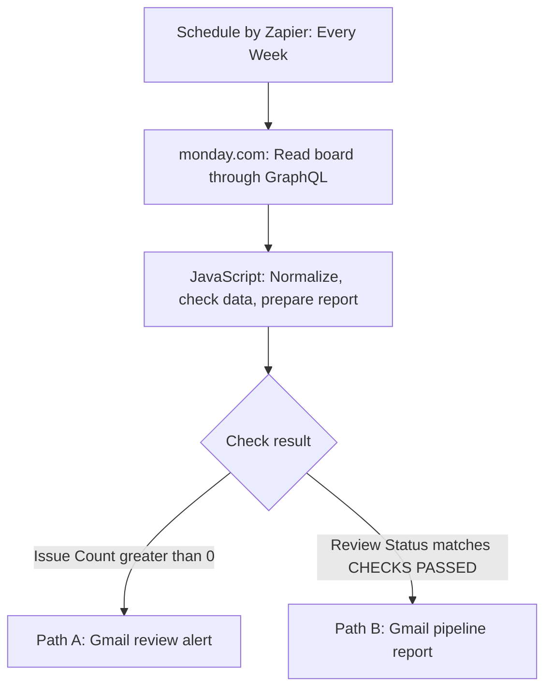
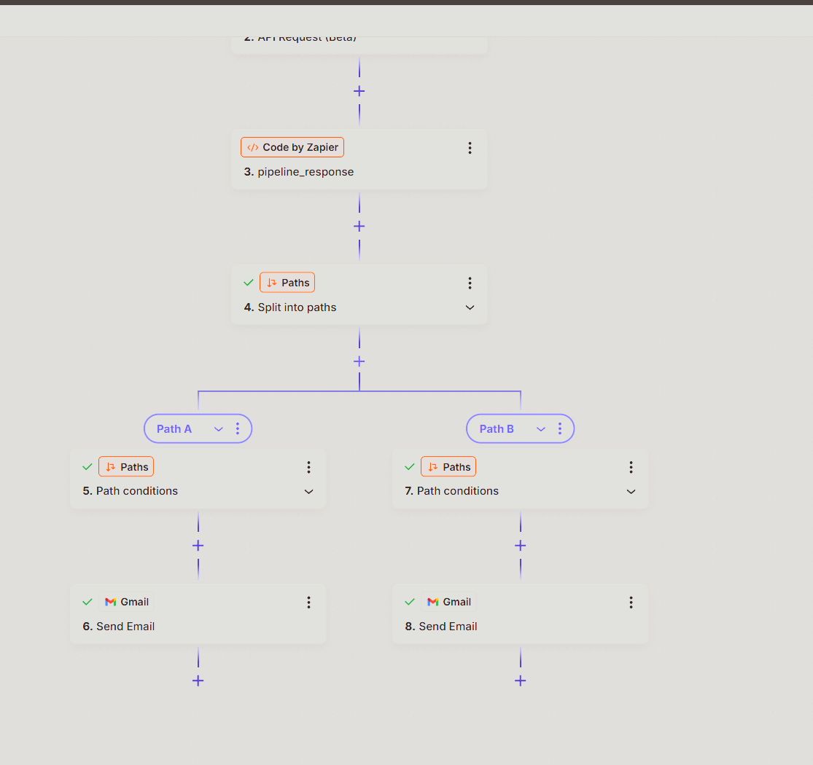
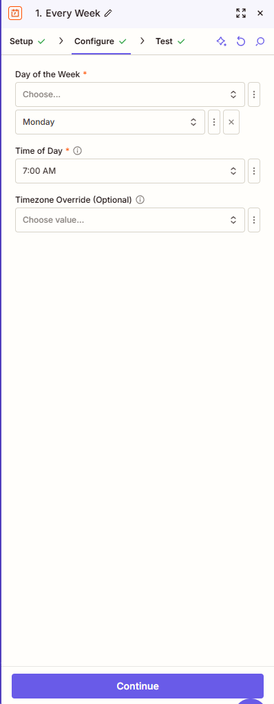
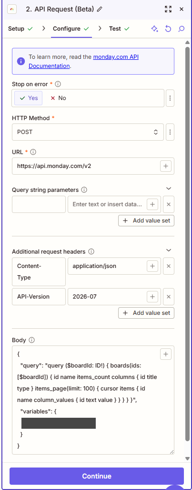
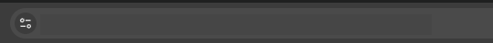
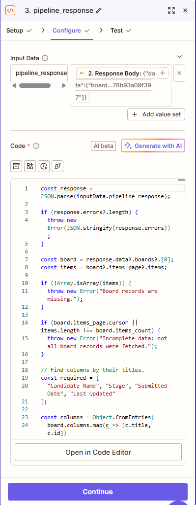
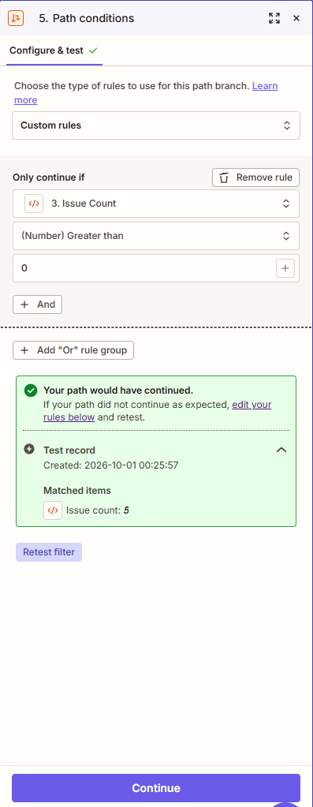
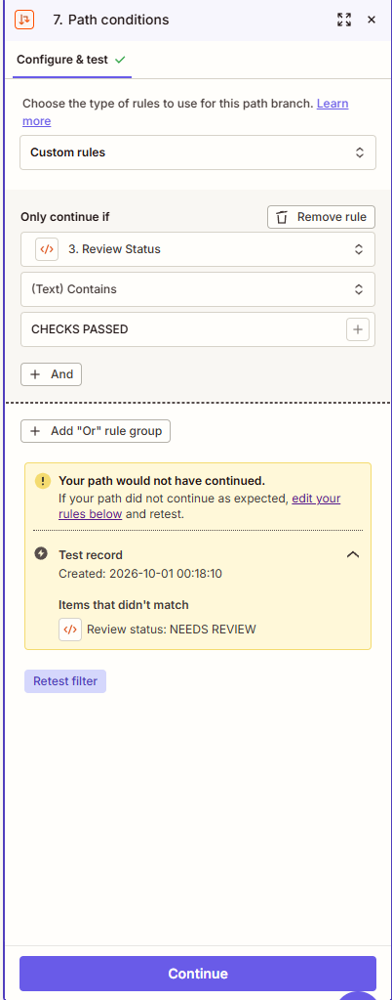
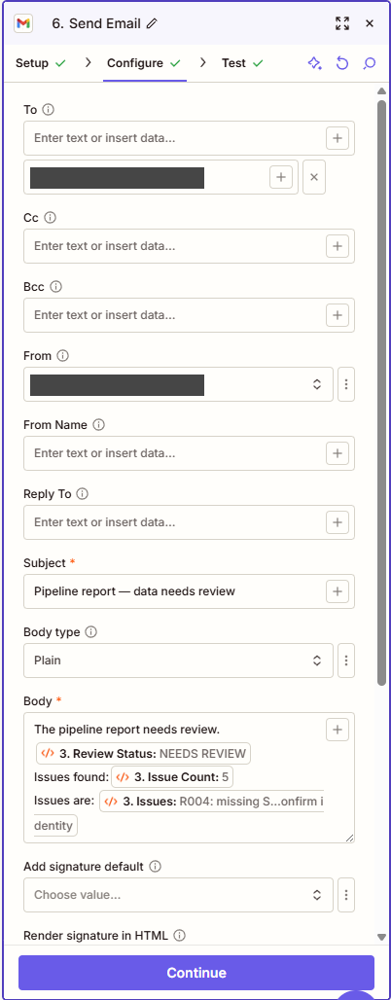
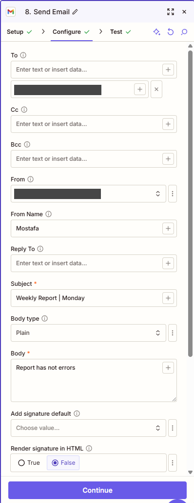

# Weekly Recruitment Pipeline Automation

**Author:** Mustafa Mohamed Al Rouby  
**Practice dates:** September 30–October 1, 2026  
**Tools:** monday.com, Zapier, JavaScript, GraphQL, Gmail

## Project overview

I built a recruitment reporting workflow using real monday.com and Zapier accounts after a recruitment assessment. The purpose was to practise automation design, data validation, conditional routing, reporting, and documentation.

The workflow reads a recruitment pipeline board, checks the records, and routes the result to either a data review alert or a weekly pipeline report. I used AI assistance to develop and debug the JavaScript while configuring the applications and testing the workflow myself.

**Verified result:** The API retrieved all 42 board records. The validation step standardized three stage labels, flagged five data quality issues, and delivered the detailed review alert through Gmail.

**Project status:** Core practice build completed. The clean-data report branch and live scheduled execution were not verified. The available Zapier plan prevented completing additional setup; failure notifications and publication were not confirmed.

## Business problem

A recruitment team needs dependable pipeline reporting. A successful API request does not prove the numbers are correct: missing stages and possible duplicate records can still produce misleading totals.

This project places record checks before report delivery. When the checks find issues, the email identifies the affected records so someone can investigate them.

## Workflow





The same flow, as captured in the Zap editor: steps 1–3 feed **4. Split into paths**, which routes to Path A (steps 5–6) and Path B (steps 7–8).

An API failure, missing response structure, missing required column, or incomplete fetch raises an error before the branches run. Separate Zapier failure notifications were proposed but were not verified as enabled.

## Dataset and scope

The practice board contained **42 records** and these fields:

| Field | Purpose |
|---|---|
| Record ID | Imported as the monday.com item name; identifies a source row |
| Candidate Name | Candidate label; used to flag possible duplicates |
| Source | Recruitment channel |
| Practice Area | Legal specialism |
| Recruiter | Assigned recruiter |
| Stage | Current pipeline stage |
| Submitted Date | Source date field; its business meaning requires confirmation |
| Last Updated | Source update date |
| Client | Associated client, where available |

The report is a **weekly snapshot of all current board records**. It does not calculate new hires or stage changes occurring within the previous week. That would require confirmed date definitions and historical stage events or saved snapshots.

The source workbook, candidate names, client names, personal email address, and account-specific board ID are excluded from this documentation package. Screenshots in this repository have workspace names, the board ID, and email addresses redacted.

## Step 1 — Configure the weekly trigger

1. Create a Zap named **Weekly Recruitment Pipeline Report**.
2. Select **Schedule by Zapier**.
3. Select the **Every Week** trigger.
4. Set the intended reporting day and time.
5. Confirm the timezone before publishing.



*Zap editor, step 1: Monday and 7:00 AM selected; the optional timezone override was left empty in this capture.*

The trigger test returned a next occurrence of **October 5, 2026, 07:00 UTC**. Monday at 7:00 AM in `Africa/Cairo` was subsequently recommended, but the final timezone setting was not verified. The test result should not be described as proof of a Cairo-time schedule.

## Step 2 — Retrieve the monday.com board

Select **monday.com → API Request (Beta)** and use the connected monday.com account.

| Setting | Configuration used |
|---|---|
| Stop on error | Yes |
| HTTP method | POST |
| URL | `https://api.monday.com/v2` |
| Content-Type | `application/json` |
| API-Version | `2026-07` |
| Query parameters | Empty |
| Authentication | Supplied through the Zapier monday.com connection |



*Zap editor, step 2: POST to `https://api.monday.com/v2` with the API version header and the GraphQL body (board ID redacted).*

The GraphQL operation reads data. Although the HTTP method is POST, the operation is a query that does not update the board.

Use the body in [monday-request.json](monday-request.json), replacing `YOUR_BOARD_ID` with the board's numeric ID. The board name is not an API board ID.



*The numeric board ID appears at the end of the board's URL (workspace name and ID redacted).*

```graphql
query ($boardId: ID!) {
  boards(ids: [$boardId]) {
    id
    name
    items_count
    columns { id title type }
    items_page(limit: 100) {
      cursor
      items {
        id
        name
        column_values { id text value }
      }
    }
  }
}
```

The request asks for up to 100 records. It also requests a cursor so an incomplete first page can be detected. Additional-page retrieval has not been implemented; the code stops if more pages remain.

### Retrieval test

An initial diagnostic JavaScript step returned:

| Output | Observed result |
|---|---|
| Reported Count | 42 |
| Fetched Count | 42 |
| More Pages | false |

This confirmed that the test retrieved all 42 records in the board at that time.

## Step 3 — Normalize data, run checks, and prepare the report

Select **Code by Zapier → Run Javascript**. Suggested step name: **Check Data and Build Report**.

### Input mapping

| Input key: left box | Mapped value: right box |
|---|---|
| `pipeline_response` | Step 2 → **Response Body** |

The complete response preserves the relationship between each record and its columns. A record count or an individual flattened field is not a substitute for the full JSON response.

Paste [src/pipeline_report.js](src/pipeline_report.js) into the code editor.



*Zap editor, step 3: `pipeline_response` mapped to step 2's Response Body, with the validation code in the editor.*

### Checks and transformations

1. Parse the response body as JSON.
2. Detect GraphQL `errors`, including errors returned inside an otherwise successful HTTP response.
3. Confirm the response contains a board items array.
4. Compare the fetched row count with `items_count` and check for a remaining cursor.
5. Find required columns by title: Candidate Name, Stage, Submitted Date, and Last Updated.
6. Trim text and collapse repeated spaces.
7. Normalize stage labels using explicit mappings.
8. Flag blank candidate names, blank or unexpected stages, and missing source dates.
9. Flag repeated normalized candidate names for identity review.
10. Prepare current-stage and cumulative totals. Release the report body only when no configured checks raise issues.

The stage mappings used were:

| Source label | Standardized label |
|---|---|
| Submitted | Submitted to Client |
| Interview | Client Interview |
| Offer | Offer Extended |

These are explicit assumptions for the assessment dataset. A different organization should confirm its own stage meanings before reusing them. Normalization changes the script output; it does not write changes back to monday.com.

Repeated names are **possible duplicates**, not automatic proof that two rows represent the same person or application. The workflow flags them for review and retains the source records.

### Output fields

| Output | Use |
|---|---|
| `review_status` | `NEEDS REVIEW` or `CHECKS PASSED` |
| `record_count` | Number of fetched records |
| `standardized_stages` | Number of stage labels changed in the output |
| `issue_count` | Number of review flags |
| `issues` | Human-readable issue details |
| `records_json` | Normalized records serialized as one JSON value |
| `report_subject` | Subject for the report email |
| `report_body` | Report text, or a withholding message when issues remain |

The consolidated script's syntax was checked locally. Its final report outputs were not demonstrated in a successful Zapier clean-data run. The earlier validation step was tested in Zapier and produced the results below.

## Step 4 — Split the workflow into paths

Add **Paths by Zapier** after step 3. Use **Custom rules**.

| Branch | Field | Condition | Comparison value |
|---|---|---|---|
| Path A: Data Issues — Send Alert | Step 3 → Issue Count | `(Number) Greater than` | `0` |
| Path B: Checks Passed — Send Report | Step 3 → Review Status | `(Text) Contains` | `CHECKS PASSED` |

The Path B test showed **“Your path would not have continued”** with a `NEEDS REVIEW` sample. That was the expected result: the report route was blocked by the data checks.

| Path A rule (step 5) | Path B rule (step 7) |
|---|---|
|  |  |
| *Issue count greater than 0 — the test path continued (issue count: 5).* | *Review status contains `CHECKS PASSED` — the test path was blocked (`NEEDS REVIEW`).* |

## Step 5 — Deliver the data review alert

Under Path A, add **Gmail → Send Email** and connect Gmail.

| Email field | Configuration |
|---|---|
| To | The project's own test recipient address |
| Subject | `Pipeline report — data needs review` |
| Body | Introductory text plus Step 3 → **Issues**; Review Status and Issue Count can also be included |

Mapping **Issue Count** alone produces a number such as `5`. Mapping **Issues** supplies the actual record-level details.



*Zap editor, step 6 (Path A): the review alert with Review Status, Issue Count, and the full issue list mapped from step 3 (email address redacted).*

### Verified issues

| Review flag | Records affected |
|---|---|
| Missing Submitted Date | R004 |
| Missing Submitted Date | R019 |
| Missing stage | R027 |
| First possible duplicate pair | R014, R015 |
| Second possible duplicate pair | R035, R042 |

### Observed validation results

| Output | Result |
|---|---|
| Review Status | NEEDS REVIEW |
| Record Count | 42 |
| Standardized Stages | 3 |
| Issue Count | 5 |

The Gmail test delivered an email containing all five issue details. This verifies the validation-alert route and email delivery for the tested sample. It does not establish that the weekly scheduled job has run in production.

## Step 6 — Configure the successful report email

The final intended design prepares the report in step 3 and uses **Gmail → Send Email** directly under Path B.

| Email field | Mapping |
|---|---|
| To | The project's own test recipient address |
| Subject | Step 3 → **Report Subject** |
| Body | Step 3 → **Report Body** |

A separate calculation step was initially added under Path B. The design was simplified to put the calculation in step 3. This documentation and the included code represent that consolidated design; the final UI changes and report email delivery were not verified after simplification.



*Zap editor, step 8 (Path B): the report email as captured during testing; the final mapping and delivery were not verified (email address redacted).*

### Metric definitions

- **Current-stage count:** records whose current stage is exactly the named stage.
- **Cumulative stage count:** records at that stage or a later stage, assuming sequential progression through the six stages.
- **Total records:** board rows, not independently verified unique people.

Cumulative totals overlap and should not be added together. Snapshot-based cumulative counts are not verified historical stage-entry counts if candidates can skip, move backward, or leave the pipeline.

Path B's successful report test was left pending at the author's request. No clean-data report email, placement total, or complete funnel total is claimed as a verified result.

## Troubleshooting lessons

| Problem encountered | Resolution or lesson |
|---|---|
| Board name entered where the API expected an ID | Use the numeric board ID |
| Input key placed in the value box | Put the key on the left and the mapped response on the right |
| Trigger output copied instead of code output | Inspect the correct step's Data out |
| Issue Count compared with the text CHECKS PASSED | Compare Review Status using `(Text) Exactly matches` |
| Record Count mapped as Records Json | Map the serialized records field, not the number of records |
| Report code blocked a sample with five issues | Blocking dirty data was expected; the source checks still required review |
| Report calculation pasted multiple times | Keep one declaration of each variable; replace the existing final block rather than appending copies |
| Alert email contained only the issue count | Map Issues so the recipient receives actionable details |

## Operating and recovery procedure

### For a data review alert

1. Open the affected monday.com records.
2. Confirm missing values against an authoritative source or the data owner.
3. Resolve possible duplicates using identity and application details, not names alone.
4. Record confirmed corrections and the reason for each change.
5. Retest the API and validation steps after corrections.
6. Release a report when the checks pass and its totals have been reviewed.

### For a failed run

1. Inspect Zap History and find the failed step.
2. Check the connected account, API response, board ID, column titles, and pagination state.
3. Correct the cause before replaying the run.
4. Check whether an email was already delivered before replaying email actions.

Zapier's immediate error notifications were recommended as the next failure-monitoring measure, but were not verified as enabled. A failure before Paths does not reach the data-quality alert branch.

## Verification status and next improvements

| Component | Status |
|---|---|
| Real monday.com and Zapier configuration | Demonstrated |
| API retrieval of all 42 records | Verified in a test |
| Validation and three stage mappings | Verified in a test |
| Five review flags | Verified in a test |
| Path B blocking the dirty-data sample | Verified in a test |
| Detailed Gmail review alert | Delivery verified |
| Consolidated script | Syntax checked locally |
| Clean-data report branch | Not verified |
| Final consolidated UI configuration | Not verified |
| Cairo timezone configuration | Not verified |
| Failure notification setup | Not verified; plan limitation reported during final setup |
| Published, unattended weekly operation | Not verified |

Further work would include a clean-data report test, confirmed source corrections, automatic pagination beyond 100 rows, validated date formats and business definitions, duplicate-review decisions stored against stable application IDs, record-ID uniqueness checks, an approved empty-board policy, and a saved run log. These are future improvements, not features already demonstrated.

## Skills demonstrated

- Connecting a live application through its API.
- Reading structured GraphQL responses.
- Mapping outputs between Zapier steps.
- Writing explicit normalization and validation rules with AI assistance.
- Separating data-quality review from report delivery.
- Testing conditional routes and checking real email delivery.
- Documenting assumptions, troubleshooting, evidence, and unfinished work.

## Suggested portfolio presentation

**Repository:** [recruitment-pipeline-automation](https://github.com/4MaxR/recruitment-pipeline-automation)

This repository holds the README, the request template, the JavaScript, and the configuration screenshots. Add a short project entry to your portfolio website and link it to the repository. GitHub provides implementation detail; the website provides a quick introduction for a recruiter.

Suggested website description:

> Built a recruitment reporting practice workflow using monday.com, Zapier, JavaScript, GraphQL, and Gmail. Tested retrieval of 42 records, standardized three stage labels, detected five data quality issues, and verified delivery of a detailed review alert. The workflow includes a conditional report route; clean-data report delivery and live scheduled execution remain unverified.

Screenshots in this repository use versions with account details hidden; candidate and client information is not shown. The raw interview assessment file is not part of this public-facing package.

## References

- [monday.com API getting started](https://developer.monday.com/api-reference/docs/getting-started)
- [monday.com items_page](https://developer.monday.com/api-reference/reference/items-page)
- [JavaScript in Zapier workflows](https://help.zapier.com/hc/en-us/articles/8496310939021-Use-JavaScript-code-in-Zap-workflows)
- [Zapier filter and path conditions](https://help.zapier.com/hc/en-us/articles/8496180919949-Filter-and-path-rules-in-Zap-workflows)
- [Zapier error notifications](https://help.zapier.com/hc/en-us/articles/8496289225229-Manage-notifications-when-errors-occur-in-Zap-workflows)
- [Schedule by Zapier](https://zapier.com/apps/schedule/integrations)
- [GitHub README documentation](https://docs.github.com/en/repositories/managing-your-repositorys-settings-and-features/customizing-your-repository/about-readmes)

This package documents the practice build and is published as the repository linked above. A portfolio website entry is a separate step that has not been performed.
