# Tucker Request Tracker: Form Intake with Create-or-Update Routing

**Author:** Mustafa Mohamed Al Rouby

**Tools:** Zapier Forms, Zapier Tables, Paths by Zapier

A Zapier Forms and Zapier Tables project that looks up a customer by email, then creates a new record or updates an existing one. A planned extension assigns a readable Request ID using the current count of populated Request IDs plus one.

## Contents

- [Project scope and status](#project-scope-and-status)
- [Workflow](#workflow)
- [Tools and prerequisites](#tools-and-prerequisites)
- [Table and form setup](#table-and-form-setup)
- [Implementation steps](#implementation-steps)
- [Planned extension: generate Request IDs](#planned-extension-generate-request-ids)
- [Test checklist](#test-checklist)
- [Troubleshooting](#troubleshooting)
- [Design limits](#design-limits)
- [Screenshot privacy](#screenshot-privacy)
- [What this demonstrates](#what-this-demonstrates)

## Project scope and status

The project uses **Request Tracker** to maintain one customer record per matching email address. Repeat submissions update the existing record rather than creating a separate request history.

| Component | Status supported by the project evidence |
| --- | --- |
| Request Tracker table and sample data | Created; eight sample records are visible. |
| New Customer Info form | Created with Full Name, Email, and Notes. |
| Form submission trigger and email lookup | Configured in the supplied screenshots. |
| Found/not-found paths | Configured. A found-result sample passed the existing-record path and stopped the new-record path. |
| Create Record and Update Record | Create action described; Update Record configuration captured with a dynamic Record ID, Priority = High, appended Notes, and a Created At mapping. Completed action results were not supplied. |
| COUNT + 1 ID generation | Planned extension, blocked by the account plan restriction encountered during the build. |
| Published automation and complete end-to-end test | Not established by the supplied evidence. |

The COUNT screenshots are reference material for the extension. Their sample output of `10` is not a verified count from the eight-row table screenshot.

## Business problem

Repeat customer submissions can create duplicate tracker entries and separate new information from an existing customer record. This workflow checks the submitted email before writing data, routing new customers to creation and matched customers to a targeted update. It maintains one matched customer record per email, not a separate request history.

## Workflow

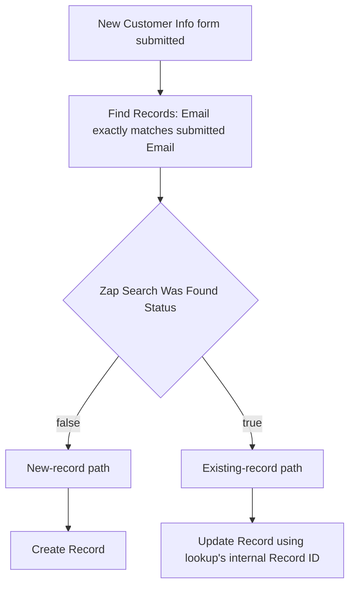

The base workflow creates a record directly in the new-record path. The optional extension is not part of the verified base build; if implemented, its calculation steps run before creation.

## Tools and prerequisites

- A Zapier account with access to Forms, Tables, and the automation features used in the project.
- The **Request Tracker** table and **New Customer Info** form.
- Access to Paths and the relevant Tables actions.
- For the planned extension, an account that exposes the required calculation features. The builder encountered a paid-plan restriction; verify feature availability in the target account before implementing it.
- Fictional submissions for testing. Use email addresses such as `alex@example.com` rather than contacting real people.

## Table and form setup

### 1. Create the Request Tracker table

Create a table named **Request Tracker** with these fields:

| Field | Purpose |
| --- | --- |
| Request ID | Readable identifier displayed in the tracker. |
| Name | Customer's full name. |
| Email | Lookup key used to identify an existing customer record. |
| Priority | Staff-managed value. The sample table uses Low, Mid, and High. |
| Status | Staff-managed progress. The sample table uses New, In Progress, and Done. |
| Owner | Staff member responsible for the customer. |
| Notes | Notes submitted through the form. |
| Created At | Record creation date. |

The sample table displays Request IDs `1` through `8`. Seed data is for demonstration, not production customer information. Names and email addresses are redacted in the published table screenshot.

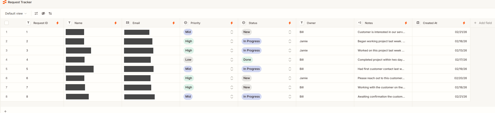

_The tracker shows eight sample rows with Request IDs 1–8. Customer names and email addresses are redacted; this is table setup evidence, not a saved automation result._

### 2. Build the New Customer Info form

Create the form in Zapier Forms and connect it to **Request Tracker**:

| Form field | Required? | Destination |
| --- | --- | --- |
| Full Name | Yes | Name |
| Email | Yes | Email |
| Notes | No | Notes |

The trigger screenshot identifies the form project as **New Customer Form**, the page as **New form**, and the form as **New Customer Info**.

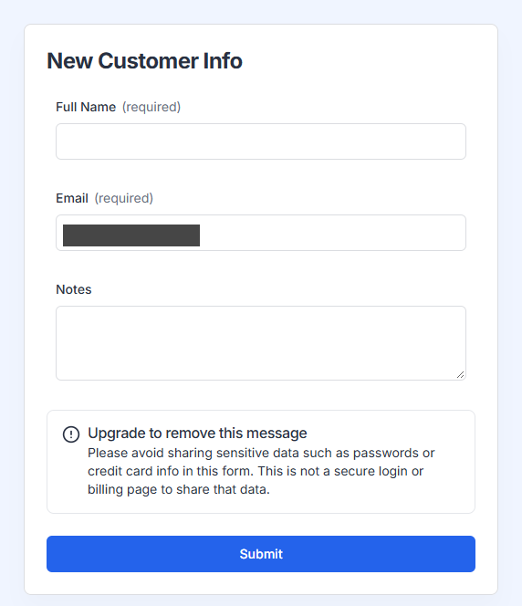

_The form shows required Full Name and Email fields, optional Notes, and Submit. The example email placeholder is redacted._

### 3. Start the automation from Form Actions

Open the form's **Actions** tab and choose **Build your own Automation**. The screenshot shows **Start Zap** as Off at that stage; confirm the automation is enabled before expecting live submissions to run it.

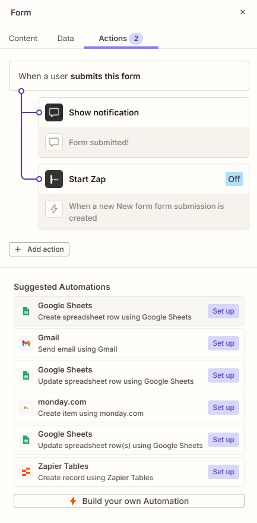

_The Actions tab shows Build your own Automation and Start Zap = Off. Publication and live triggering are not established by this capture._

## Implementation steps

### 4. Configure the Form Submission Created trigger

Select **Form Submission Created**, then choose the project, page, and form listed above. Load a test submission containing Full Name, Email, and Notes.

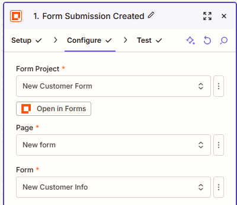

_The trigger points to the selected project, page, and form. Returned submission data is not shown here._

### 5. Find an existing record by email

Add **Zapier Tables → Find Records** with the following configuration:

| Setting | Value |
| --- | --- |
| Table ID | Request Tracker |
| Filter Count | 1 |
| Use Table/View Ordering | True |
| Lookup Field 1 | Email |
| Operator | is exactly |
| Lookup Value | Email from the form trigger |
| Successful if no search results are found? | True; allow the step to succeed without a match |
| If multiple search results are found | Return the first search result |
| Create record if it doesn't exist yet? | Unchecked |

Allowing an empty search to succeed is essential: the Zap must reach Paths so it can create a record when no match exists. Keep automatic record creation in the lookup unchecked because creation is handled by the new-record path.

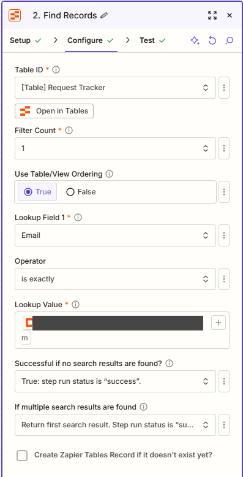

_Exact Email lookup, success on no match, first-result selection, and automatic creation unchecked. The sample email is redacted._

### 6. Configure create-or-update Paths

Use **Zap Search Was Found Status** from Find Records:

| Path | Condition shown in the build | Next action |
| --- | --- | --- |
| New customer | `(Text) Contains` → `false` | Create Record |
| Existing customer | `(Text) Contains` → `true` | Update Record |

Test each path with the appropriate lookup result. A True sample stopping the false path is the expected result, not a failed automation.

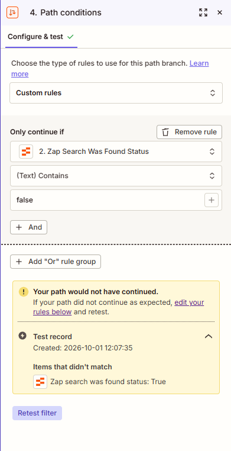

_The false rule correctly would not continue for a True sample. This verifies rejection of a found record, not successful creation for a new email._

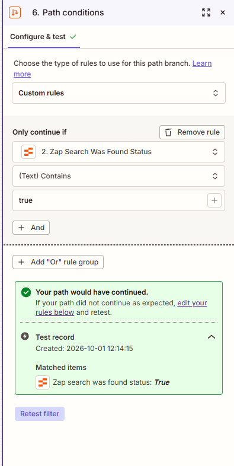

_The True sample matched and the existing-record path would have continued. This is a condition test, not proof of a completed update._

### 7. Create a record when no match exists

Select **Request Tracker** and map Full Name to Name, Email to Email, and Notes to Notes. Keep the staff-managed fields under company control.

Suggested initial settings for a reproducible demo are **Status = New** and blank Priority and Owner. These are recommendations; the supplied screenshots do not show the Create Record field configuration. Preserve the creation date through an appropriate table default or explicit mapping and verify it during testing.

Once the ID extension is available, insert its calculation steps before this action and map the calculated result into **Request ID**.

### 8. Update the existing record

**Captured configuration:** the action targets `2. Record ID` from the lookup, sets **Priority = High**, and combines the existing `2. Notes` with an `UPDATE:` label and the submitted `1. Form Data: Notes`. Name and Email are blank in the capture. Created At is also populated with a date-time token; the complete source step is not established. This is configuration evidence, not proof of a saved update. Confirm whether changing Created At is intentional; preserving the original creation timestamp is the safer handoff default.

The following field policy is a **recommended alternative**, not a description of those captured mappings.

The important configuration detail is the update target:

1. Select **Request Tracker** in the Update Record action.
2. Open the three-dot menu beside **Record ID**.
3. Switch the field to **Custom**.
4. Map the internal **Record ID returned by Find Records**.
5. Map the form's Full Name to Name and Notes to Notes.
6. Preserve Request ID, Email, Priority, Status, Owner, and Created At.

The field-update policy above is a recommended handoff default. Verify the action's actual mappings before enabling it. In particular, confirm that omitted fields are preserved rather than cleared.

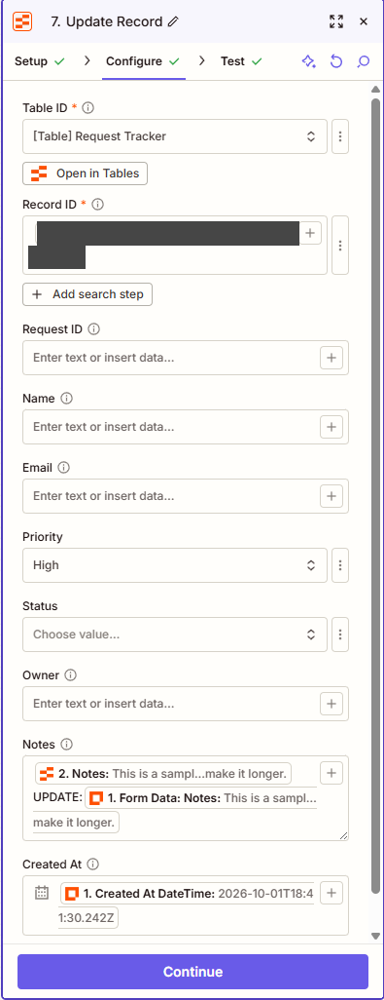

_The dynamic lookup Record ID is redacted. Priority = High; Notes combines existing Notes, UPDATE, and submitted Notes; Created At is populated. No saved-update result is shown._

**Record ID and Request ID have different jobs.** Zapier Tables supplies an internal record identifier for action targeting. The Request ID column is a separate display identifier. Do not pass the visible Request ID or a row position to Update Record in place of the lookup's internal Record ID.

Under the recommended policy, each repeat submission replaces Notes with the latest submitted value. It does not append a history. Decide how blank Notes submissions should behave before using this with live customers.

## Planned extension: generate Request IDs

This extension was understood and documented but not completed because of the plan restriction encountered by the builder.

### Configure the table calculation

1. In Request Tracker, open **Calculate** for the **Request ID** field.
2. Select **COUNT**.
3. Confirm the displayed count. The reference image displays `COUNT: 10`.

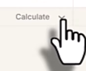

_Reference material for opening Calculate on the table field; account feature access still needs confirmation._

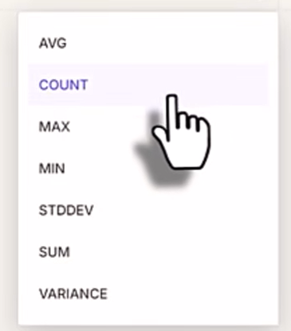

_Reference calculation menu with COUNT among the aggregate options._

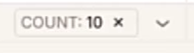

_The reference count is 10; this is not a verified count from the eight-row tracker capture._

### Read the count in the Zap

In the **new-record path**, before Create Record:

1. Add **Zapier Tables → Calculate Summary Formula**.
2. Set **Table ID** to Request Tracker.
3. Set **Calculate Field** to Request ID.
4. Set **Aggregate Function** to `count`.
5. Test the action and inspect the returned **Value**.

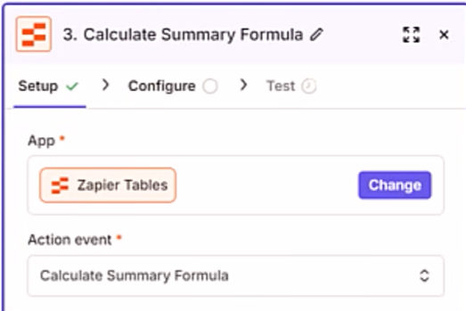

_Reference action setup in Zapier Tables. If implemented, this step belongs before Create Record._

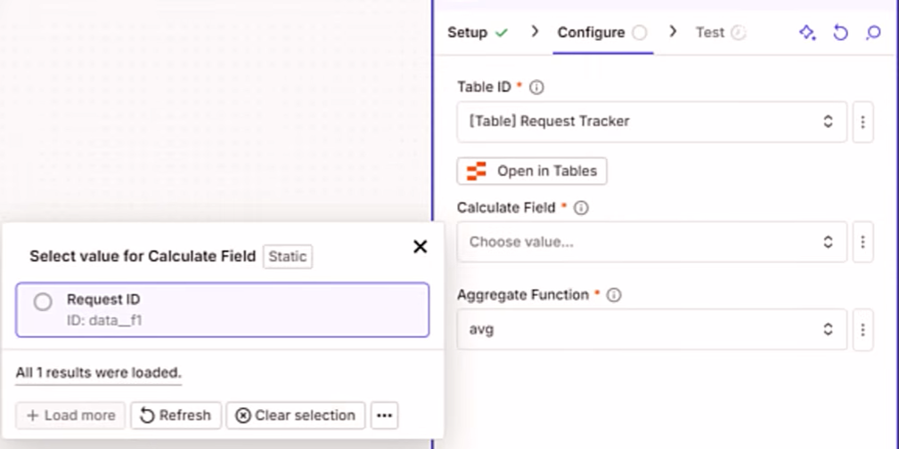

_Request ID is the field to aggregate; the action does not select a separate field named COUNT._

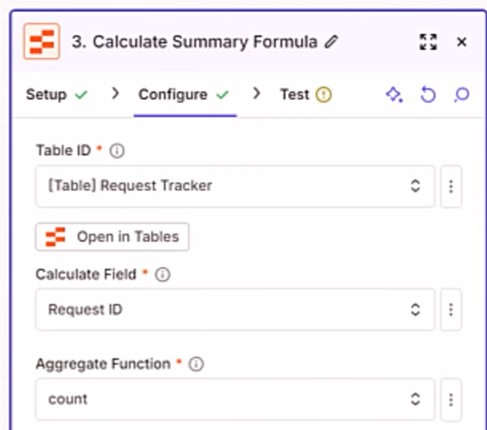

_Reference settings: Request Tracker, Calculate Field = Request ID, Aggregate Function = count._

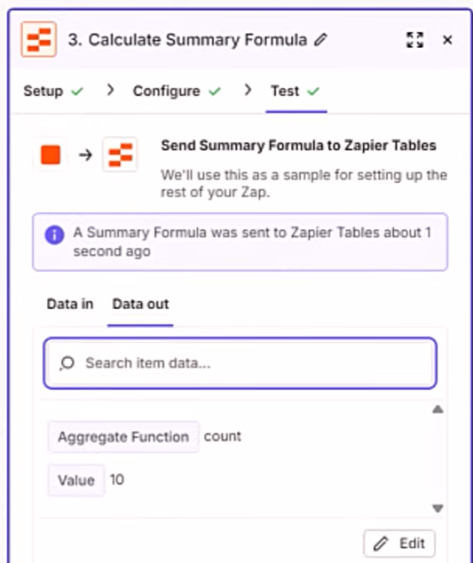

_The reference output shows count and Value = 10. It does not establish execution of this extension in the builder's account._

The reference action output shows `Aggregate Function: count` and `Value: 10`. The action selects the Request ID field and the count aggregate; it does not select a separate field named COUNT.

### Add one before creation

Apply an arithmetic step to the returned Value:

```text
Next Request ID = COUNT(Request ID) + 1
```

For eight populated Request IDs, the next value would be `9`. For the reference count of ten, it would be `11`.

One implementation option is a Formatter by Zapier arithmetic step that adds `1` to the count. This addition step is proposed implementation guidance and was not shown or tested in the supplied images. Map its output into Create Record → Request ID, then verify the saved value.

## Test checklist

| Test | Expected result |
| --- | --- |
| New email, such as alex@example.com | Lookup returns false; one record is created. |
| Repeat the same email with changed Notes | Lookup returns true; the matching record is updated; record count does not increase. Captured mapping appends old Notes + UPDATE + submitted Notes; the recommended alternative replaces Notes and updates Name. Verify the chosen policy. |
| Review the internal update target | Updated record's internal ID matches the Find Records result. |
| Review staff fields after an update | Request ID, Priority, Status, Owner, and Created At retain their previous values. |
| Blank Notes on a repeat submission | Behavior matches the chosen policy for retaining or clearing existing Notes. |
| ID extension with eight populated Request IDs | Calculation returns 8; addition returns 9; new record stores Request ID 9. |
| Multiple records with the same email | Lookup returns the first result according to table/view ordering; treat this as a data issue. |
| Automation enabled and live form submitted | The intended path runs once and produces the expected saved record. |

Record actual outcomes before marking these checks complete. The provided path test confirms routing for a found-result sample; it does not prove successful record creation, updating, ID generation, or publication.

## Troubleshooting

| Symptom | Check |
| --- | --- |
| Zap stops when the email is new | Set the lookup to succeed when no search results are found. |
| New submission creates duplicate records | Check for an additional automatic table write from the form connection and confirm lookup auto-creation is unchecked. |
| Cannot map Record ID dynamically | Use the three-dot menu to switch Record ID to Custom. |
| Wrong customer gets updated | Map the internal Record ID from Find Records, not the visible Request ID or a static selection. |
| COUNT calculation is unavailable | Check account feature access; keep this extension marked unimplemented until available. |
| New Request ID matches an existing one | Investigate deleted records, blank Request IDs, or overlapping submissions. |
| Form submits but no Zap run appears | Check Start Zap and the automation's enabled/published state. |

## Design limits

- **Email identifies the customer, not a distinct request.** This design keeps one matched customer record. Tracking multiple requests from one customer would need a separate request history or a different lookup key.
- **Exact lookup depends on consistent input.** Whitespace or different email formatting can affect matching. No normalization step was shown.
- **Returning the first result does not enforce uniqueness.** Existing duplicate emails can cause the wrong record to be chosen.
- **COUNT + 1 is suitable for this demonstration, not a guaranteed unique sequence.** Deleting a record can make the count reuse an existing ID. Two concurrent runs can read the same count and both generate the same next ID. Blank Request IDs can also affect the count being used.
- **Creation and calculation are separate operations.** Use the internal Record ID for reliable action targeting. A production requirement for sequential display IDs needs a counter that reserves each value atomically.

## Screenshot privacy

All 15 supplied screenshots are embedded beside their matching setup steps above. Gray boxes hide sample names, email addresses, and internal record identifiers. Originals and the source document are kept in the ignored `_private/tucker-table-form-originals/` directory and are not published.

## What this demonstrates

Form intake, table schema design, exact-match lookup, create-or-update branching, dynamic record targeting, and combining existing Notes with a submitted update. The optional aggregate calculation is documented separately from the base workflow. Successful record creation, saved updates, and live publication still need end-to-end verification.
