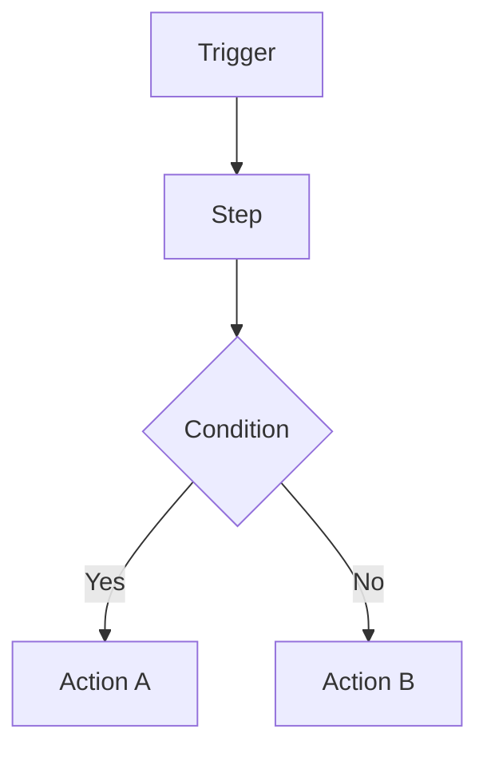

# [Project name]

**Author:** Mustafa Mohamed Al Rouby  
**Dates:**  
**Tools:**  

## Project overview

What was built, on which real accounts, and the purpose. Keep it factual.

**Verified result:** What testing actually proved (include the numbers and the evidence).

**Project status:** What is completed versus what remains unverified.

## Business problem

Why this automation matters and what manual process it replaces.

## Workflow

One short paragraph describing the flow, its error handling, and any branches.

## Architecture and tools

| Tool | Role |
| --- | --- |
| | |

## Implementation steps

1. Step-by-step configuration, in the order it was performed.

## Field mappings

| Destination field | Source / value |
| --- | --- |
| | |

## Testing notes and acceptance checks

| Check | Expected result | Evidence |
| --- | --- | --- |
| | | |

## Design decisions

- Explain why each significant choice was made.

## Verification status

| Component | Status |
| --- | --- |
| | |

## What this demonstrates

- List the concrete skills the project shows.

## Screenshots

Add screenshots under `screenshots/` and caption each one; redact account details, IDs, and email addresses before publishing.

## References

- Link the platform documentation used.
