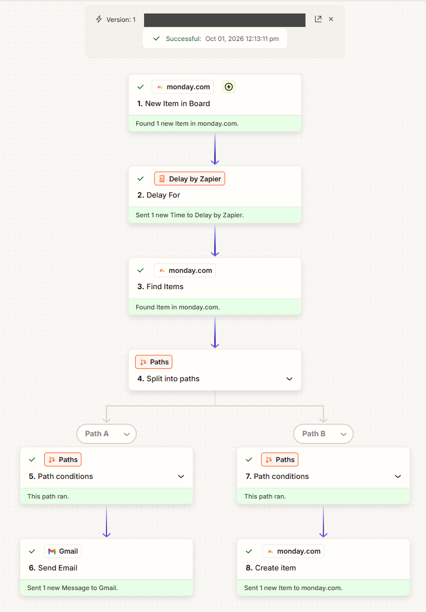
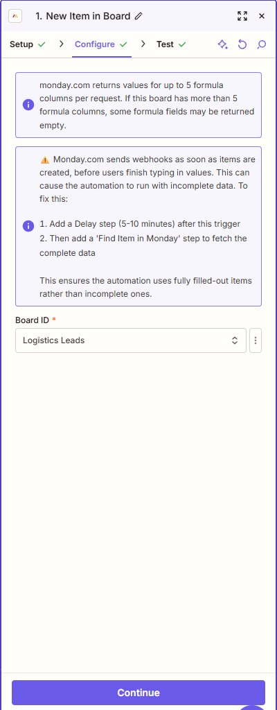
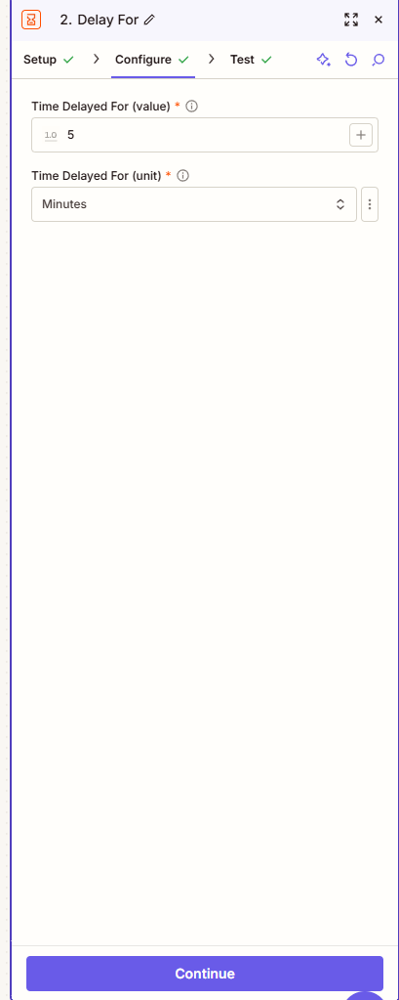
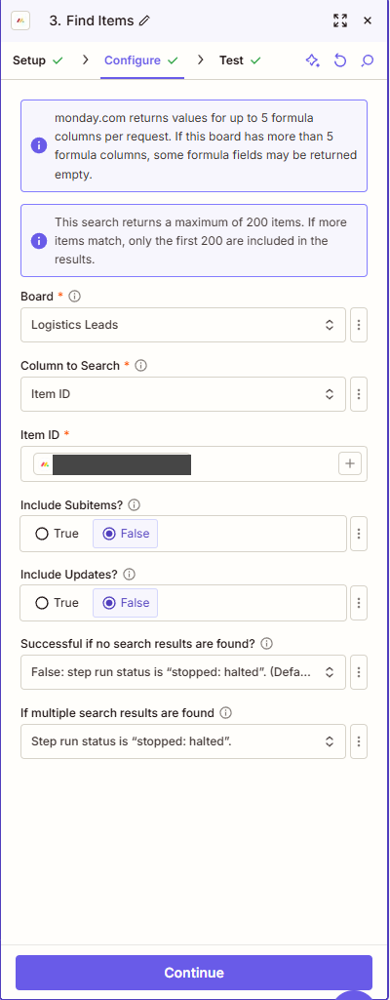
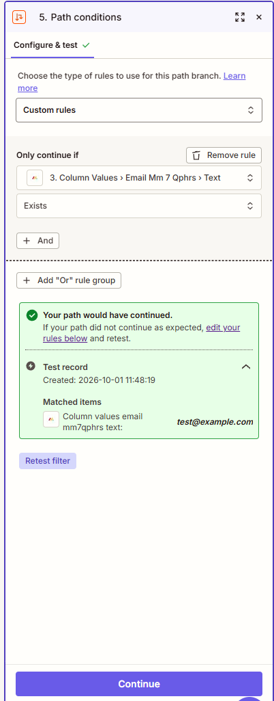
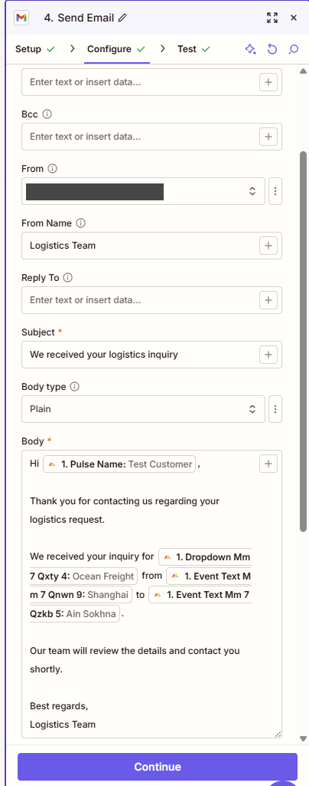
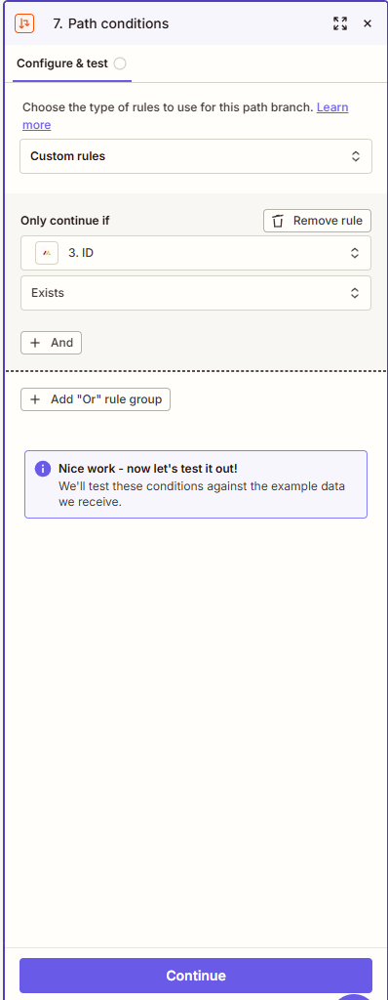
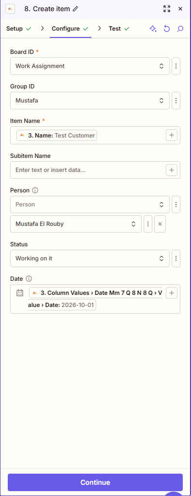

# Logistics CRM and Lead Confirmation Automation

## Project overview

Built a logistics lead intake workflow using monday.com, a monday WorkForm, Zapier, and Gmail. A prospect submits a request through the form; monday.com records it on the **Logistics Leads** board; a Zap waits briefly, retrieves the completed lead record, and sends a personalized acknowledgment email. A separate **Logistics Deals** board supports the next stage of the sales pipeline.

**Project scope at this checkpoint:** The boards, sample lead data, form, Zapier trigger, five-minute delay, and Item ID lookup were set up. Screenshots show passing tests for the delay and lookup. Path A's Gmail action sent a correctly personalized test message, but delivery bounced because the sample recipient was `test@example.com`. Path B now uses **Create Item** on the Work Assignment board, and that action's step test passed. Its custom condition is **Step 3 ID exists**; the latest screenshot shows it configured but awaiting its condition test. No resulting assignment row was shown. The available evidence does not confirm that Gmail uses the refreshed lookup output, that the Zap was published, or that a live form submission reached a real inbox. The qualified-lead-to-deal automation remains a planned next step.

## Business problem

Logistics inquiries can arrive with incomplete details and wait for a manual response. The workflow standardizes intake, gives the sales team one place to review requests, and provides a prompt confirmation to the prospect. It also keeps lead intake distinct from deal management.

## Architecture and tools

```text
Prospect → monday WorkForm → Logistics Leads board
                               ↓ new item
                      Zapier: delay 5 minutes
                               ↓
                  Find lead by unique Item ID
                               ↓
                         Zapier Paths
                         ↙          ↘
              Gmail confirmation   Work Assignment item
                                   (in progress)

Qualified lead → monday native automation → Logistics Deals board
                (planned next step)
```

| Tool | Role |
| --- | --- |
| monday.com | Lead and deal boards, structured fields, and internal workflow |
| monday WorkForm | Public-facing intake connected to Logistics Leads |
| Zapier | Watches for a new monday item, delays, retrieves the completed item, and passes its data to Gmail |
| Gmail | Sends the prospect's confirmation email |



_The same flow captured as a successful Zap run: the 5-minute delay, the Item ID lookup, and both paths running — Gmail confirmation on Path A and Create Item on Path B._

## Implementation through the current state

1. **Create the CRM boards.** Create **Logistics Leads** for inbound inquiries and **Logistics Deals** for sales opportunities. Keep the boards separate so intake records and active deals can be managed with different statuses and owners.
2. **Define lead fields.** Add the lead identity and contact details, company, requested service, origin, destination, estimated value, sales owner, and lead status to Logistics Leads. Use consistent column names so form answers and Zapier fields are easy to identify.
3. **Define deal fields.** Add deal name, company, contact name, service, origin, destination, estimated revenue, deal owner, and deal stage to Logistics Deals. These support the planned lead-to-deal handoff.
4. **Add sample data.** Enter representative leads in Logistics Leads and check that the fields, statuses, and board layout are usable. Sample records provide realistic data for mapping and testing without using a production prospect.
5. **Build the intake form.** Create a monday WorkForm tied to **Logistics Leads**. Connect its questions to the matching lead columns and submit a sample inquiry to confirm that the form creates an item on the correct board.
6. **Configure the Zapier trigger.** Connect monday.com in Zapier, select a **new item** trigger, and point it to Logistics Leads. Load a sample item and confirm that the fields needed for the email are available.

    

    _Zap editor, step 1: the monday.com new-item trigger pointed at Logistics Leads. Zapier's own note in the capture recommends adding a delay and a lookup so the automation does not run on incomplete form data._
7. **Wait for item fields to populate.** Add **Delay by Zapier → Delay For** immediately after the trigger and set it to **5 minutes**. monday.com may signal item creation before all form-backed columns are available. The screenshot shows this step configured and tested.

    

    _Zap editor, step 2: Delay For set to 5 minutes; the step test passed._
8. **Retrieve the exact lead.** Add **monday.com → Find Items** after the delay. Select **Logistics Leads**, search the **Item ID** column, and map the Item ID from the Step 1 trigger as the search value. Exclude subitems and updates. Set both **no search results** and **multiple search results** to **Stop: halted**, so a missing or ambiguous lookup cannot feed an email. The screenshot shows this step configured and tested. Confirm that its returned Item ID matches Step 1 before using its fields.

    

    _Zap editor, step 3: Find Items searches Logistics Leads by the Item ID mapped from step 1, with halted status on zero or multiple matches; the step test passed. The sample item ID is redacted._
9. **Split the workflow into paths.** Add **Paths by Zapier** after Find Items. Path A handles the prospect's acknowledgment; Path B creates internal follow-up work. Both paths can run for the same lead when their rules are satisfied.
10. **Configure Path A: send confirmation.** Use **Gmail → Send Email**. Set the recipient to the lead's Email, the sender name to `Logistics Team`, the subject to `We received your logistics inquiry`, and the body type to plain text. Insert Lead Name, Service, Origin, and Destination into the message. An earlier action test sent a correctly personalized email; after adding the lookup, confirm these fields are mapped from **Step 3 Find Items** and retest.

    

    _Path A rule: continue when the refreshed Email column exists. The test record matched — the sample address is `test@example.com`._

    

    _Path A, Gmail: the personalized acknowledgment with Lead Name, Service, Origin, and Destination inserted; the sending address is redacted._
11. **Configure Path B: create work assignment.** Use **monday.com → Create Item** on the **Work Assignment** board. The screenshot shows group `Mustafa`, item name mapped from Step 3 Name, a selected person, status `Working on it`, and a Date value mapped from Step 3. Its action test passed. Set the Path B custom rule to **Step 3 ID exists** and test that rule; the latest screenshot shows the rule before its test. Check the new row on the board and add a source lead ID or link for traceability.

    

    _Path B rule: continue when the Step 3 item ID exists. Captured before its condition test._

    

    _Path B, Create Item: the Work Assignment board, group, item name, person, status, and date mapping. The step test passed; the resulting board row was not shown. The sample lead is `Test Customer`._
12. **Verify and publish.** Test both paths with a new sample lead, confirm the Gmail fields and Work Assignment row, and then publish the Zap. Submit a fresh WorkForm response using a real email address to check live delivery. Publication and the full live test are not confirmed in the available evidence.

_Screenshots in this folder have the sample item ID and the sending email address redacted. Captions state whether each step was verified or is still awaiting its test._

### Internal assignment branch (in progress)

The Zap editor shows a **Paths** split after Find Items. Path B's rule is **Step 3 ID → Exists**. Because Find Items stops when no item is found, this rule should pass for a successful lookup. The latest screenshot shows the rule ready to test, while the Create Item action itself has a passing test. The resulting Work Assignment row has not been shown.

Before publishing:

1. Test **Path B conditions** and confirm Zapier says the branch would run for a valid lead. If every lead needs an assignment, **Always run** is a simpler alternative to the current ID-exists rule.
2. Make the item name action-oriented, such as `Follow up: [Lead Name]`, and include the source lead's Item ID or URL so the assignee can return to the inquiry.
3. Confirm that the mapped Date is the intended **follow-up due date**, not merely the lead creation date. Select a suitable starting status.
4. Check the Work Assignment board for the test row and verify that the correct owner, date, status, and lead reference were created. Then run a fresh form submission through both paths.

## Field mappings

### WorkForm and lead record

The WorkForm writes answers to the corresponding columns on **Logistics Leads**. The key fields for the email workflow are **Lead Name**, **Email**, **Service**, **Origin**, and **Destination**. Company, Estimated Value, Sales Owner, and Lead Status provide CRM context for follow-up.

### New lead to confirmation email

The lookup key is **Step 1 Item ID → Step 3 Find Items / Item ID**. The search must return exactly one item; otherwise the Zap stops. Once remapped, Gmail should read the fields from that refreshed item.

| Gmail field or message element | monday.com source or value |
| --- | --- |
| To | Email from the refreshed Logistics Leads item |
| From | Connected Gmail account |
| From Name | `Logistics Team` |
| Subject | `We received your logistics inquiry` |
| Greeting | Lead Name from the refreshed item |
| Request summary | Service, Origin, Destination from the refreshed item |

**Email body template** (the bracketed values represent Zapier-inserted monday fields):

```text
Hi [Lead Name],

Thank you for contacting us regarding your logistics request.

We received your inquiry for [Service] from [Origin] to [Destination].

Our team will review the details and contact you shortly.

Best regards,
Logistics Team
```

### Lead to Work Assignment item

| Work Assignment field | Current Zapier mapping | Check before publishing |
| --- | --- | --- |
| Board | `Work Assignment` | Confirm the new item appears there |
| Group | `Mustafa` | Confirm this is the intended work queue |
| Item name | Step 3 Name | Prefer `Follow up: [Lead Name]` so the task is clear |
| Person | Selected user | Confirm the right owner receives the task |
| Status | `Working on it` | Confirm work starts immediately; otherwise use an unstarted status |
| Date | Step 3 Date value | Confirm it represents the follow-up due date |
| Lead reference | Not shown | Add the source lead's Item ID or URL |

### Planned qualified lead to deal mapping

The next planned monday automation is: **When Lead Status changes to Qualified, create an item in Logistics Deals.** This mapping was specified but has not been verified as implemented.

| Logistics Leads | Logistics Deals |
| --- | --- |
| Lead Name | Deal Name |
| Company | Company |
| Lead Name | Contact Name |
| Service | Service |
| Origin | Origin |
| Destination | Destination |
| Estimated Value | Estimated Revenue |
| Sales Owner | Deal Owner |
| `Qualified` status event | Create deal with Deal Stage = `Qualification` |

## Testing notes and acceptance checks

| Check | Expected result | Evidence at this checkpoint |
| --- | --- | --- |
| Submit the WorkForm | One new item appears in Logistics Leads with the submitted values | Form-to-board setup is in project scope; no captured result is available in the referenced conversation |
| Test the Zapier trigger | Zapier loads a new lead item and exposes the fields used by Gmail | Trigger configuration is described; no saved test record is available |
| Test the five-minute delay | The Delay For step is configured for 5 minutes | Screenshot shows the configured value and a passed step test |
| Test the Item ID lookup | Find Items locates one lead by the trigger's Item ID after the delay | Screenshot shows the Item ID mapping, halt-on-zero-or-multiple settings, and a passed step test; returned fields are not shown |
| Test the Gmail action | Gmail sends a readable email with the correct name and route | Passed for the send action and field mapping. The screenshot shows “Hi Test Customer” and an Ocean Freight request from Shanghai to Ain Sokhna. Gmail returned an address-not-found notice for `test@example.com`, so recipient delivery was not verified. |
| Retest Gmail after lookup | Gmail uses the refreshed Find Items fields and sends to the intended recipient | Not yet verified in the provided screenshots |
| Test Path B conditions | A valid Step 3 ID allows Path B to continue | The `Step 3 ID exists` rule is configured; its test result is not shown |
| Create an internal assignment | One item appears in Work Assignment with the right lead reference and owner | Path B's Create Item step test passed; the resulting board row and lead reference are not shown |
| Publish and submit a fresh form response | A live new item triggers one confirmation email | Publication and live delivery are not confirmed in the referenced conversation |
| Qualify an existing lead | A mapped item appears in Logistics Deals at `Qualification` | Planned next step; not yet verified |

For a portfolio demonstration, retain a redacted form submission, its corresponding lead item, the Zap run record, and the received email. Use test contact details and remove personal data from screenshots.

## Design decisions

- **Use monday.com for internal CRM transitions.** Lead status and deal creation belong in the same platform, so the planned qualification handoff should use a monday native automation.
- **Use Zapier for the external integration.** Zapier connects the monday lead record to Gmail and keeps the customer acknowledgment separate from internal board logic.
- **Create an assignment from the validated lead.** The proposed Zapier assignment branch can reuse the refreshed lead data already retrieved for Gmail. It is still being configured and tested; the qualified-lead-to-deal transition remains planned as a monday native automation.
- **Delay and retrieve the lead by Item ID.** A five-minute wait gives monday.com time to finish populating fields; the lookup refreshes the data. The unique Item ID avoids a name collision, and halt-on-zero-or-multiple settings prevent an uncertain match from reaching Gmail.
- **Keep the email concise and data-driven.** Repeating the service and route helps the prospect verify that the request was captured correctly.
- **Test at two levels.** An action test checks field mapping; a fresh WorkForm submission after publication checks the complete live workflow.

## What this demonstrates

This project shows structured documentation, clear asynchronous handoff notes, practical process design, CRM data modeling, cross-tool automation, and test planning. The explicit distinction between configured, tested, and still-to-be-verified steps supports reliable remote collaboration.
