# TuckerTech Customer Intake and Technician Routing Automation

**Author:** Mustafa Mohamed Al Rouby  
**Dates:** October 1, 2026  
**Tools:** Google Forms, Zapier, Google Sheets, Gmail

## Project overview

Built a customer-intake and routing workflow for a computer repair business using Google Forms, Zapier, Google Sheets, and Gmail. A customer submits a repair request through a Google Form; Zapier formats the submission date, splits requests by device type, records each request in a Google Sheets tracker, and — after a 30-minute review window — assigns supported requests to a technician. PC requests go to Sarah and Mac requests to Joey. Requests for other devices are recorded as **Declined** and receive a reply explaining that the shop only services PC and Mac.

**Verified result:** A PC test submission passed the supported-device rule, and both nested rules behaved as designed — the PC rule matched the test record while the Mac rule and the Other-device rule correctly rejected it. In the recorded run, the form received a response, the formatter ran, the supported path ran, and a tracker row was created.

**Project status:** Core workflow configured and partially tested. The recorded run paused at the 30-minute delay, so the technician-assignment updates were not observed completing; the declined-request path was not exercised end to end; and publication was not confirmed. The evidence for each step is listed below.

## Business problem

A repair shop receives requests through phone calls, messages, and walk-ins — and someone has to record each one, decide whether it is a device the shop can service, and route it to the right technician. Manual intake is slow, easy to miss, and gives customers no reply at all when the request is out of scope.

This workflow standardizes intake in one form, records every request in one tracker (including requests that cannot be serviced), answers unsupported requests politely instead of ignoring them, and keeps a 30-minute review window in which staff can check the tracker before assignment runs automatically.

## Workflow

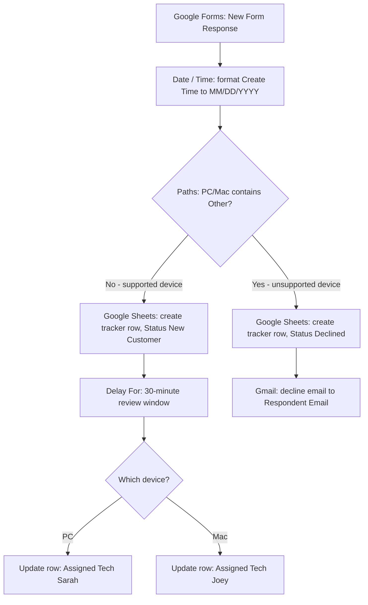

The supported branch waits 30 minutes so the request is visible in the tracker while staff can still review it; assignment then continues automatically — the delay is a timed pause, not an approval gate. The Other-device branch has no delay in the final design. An acknowledgement email that existed in an earlier version was removed; supported-device customers receive no email in the final design.

## Tools

| Tool | Role |
| --- | --- |
| Google Forms | Customer-facing intake form ("TuckerTech Compy Repair New Issue Registration") — contact details, device type, OS, and the issue description |
| Zapier | Trigger, date formatter, Paths routing (including nested paths), Delay For, Google Sheets row actions, Gmail send |
| Google Sheets | Customer tracker — one row per request, including declined requests |
| Gmail | Declined-request email for unsupported devices |

## Customer tracker

The tracker is a Google Sheets workbook named **TuckerTech CustomerTracker**, worksheet **Customers**.

| Column | Filled by |
| --- | --- |
| Name, Email, Phone | Form answers |
| Status | Automation: `New Customer` or `Declined` |
| PC/Mac, Desk/Laptop, OS, Issue From Customer | Form answers |
| Date Recieved | Automation: the formatted submission date (see the testing note below) |
| Assigned Tech | Automation after the review window: `Sarah` (PC) or `Joey` (Mac) |
| Notes | Left blank for staff to complete |

A copy of the tracker with six fictional sample rows is included at [data/tuckertech-customer-tracker.xlsx](data/tuckertech-customer-tracker.xlsx), keeping the original formatting (bold headers, filters, frozen top row, wrapped description columns).

Two details to keep in mind: the **Email** column stores the form's Email answer while the decline email sends to the form's **Respondent Email** — these can differ, and delivery uses Respondent Email. The date column header is spelled **Date Recieved** as it appears in the tracker.

## Implementation steps

1. **Build the intake form.** Google Forms form with questions for Name, Email, Phone, PC/Mac (PC · Mac · Other), Desk/Laptop, OS, and a free-text issue description.
2. **Connect the trigger.** Zapier → Google Forms → **New Form Response** on the intake form.

    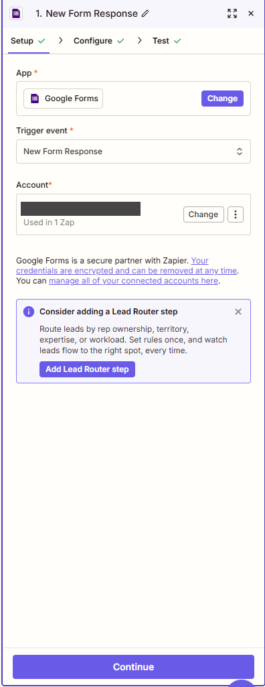

    _Zap editor, step 1: the Google Forms trigger on the intake form. The connected account address is redacted._
3. **Format the submission date.** Formatter by Zapier → **Date / Time** → Format: take `1. Create Time`, convert from UTC to **Africa/Cairo**, and output **MM/DD/YYYY** — the local calendar date without a time of day.

    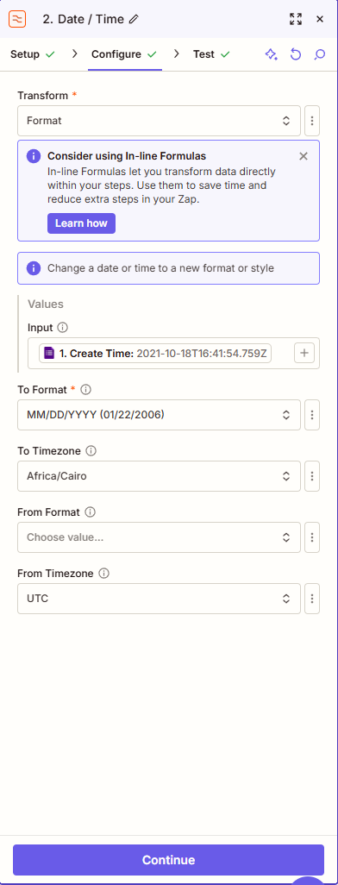

    _Zap editor, step 2: Create Time from the form, output as MM/DD/YYYY in Africa/Cairo._
4. **Split the workflow.** Paths by Zapier → two branches. Path A continues when **PC/Mac does not contain "Other"** — with the three form choices of PC, Mac, and Other, this admits PC and Mac.

    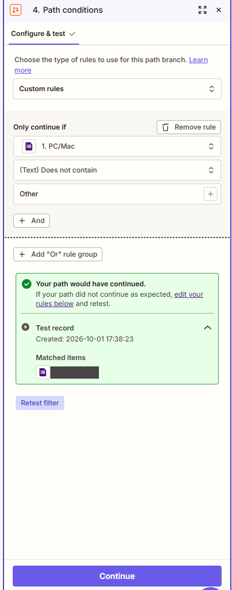

    _Path A rule: `PC/Mac` (Text) does not contain `Other`. The PC test record matched (sample record ID redacted)._
5. **Record the request.** → Google Sheets **Create Multiple Spreadsheet Rows** on the tracker with Status `New Customer`; Assigned Tech and Notes are left blank.

    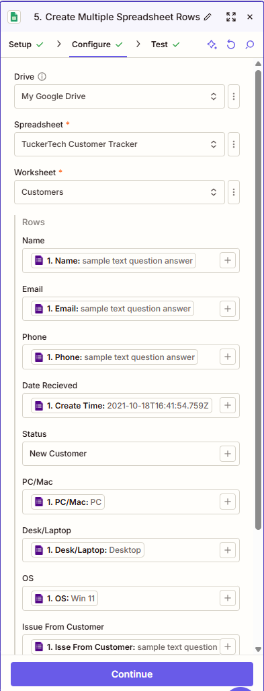

    _Create rows: the tracker row with Status `New Customer`; Name, Email, Phone, and device fields mapped from the form._
6. **Wait for review.** → **Delay For** set to **30 minutes**, so the row is visible in the tracker during the review window. This step was not captured in a screenshot.
7. **Route by device.** Nested paths under the supported branch: the PC rule continues when **PC/Mac contains "PC"**; the Mac rule continues when **PC/Mac contains "Mac"**.

    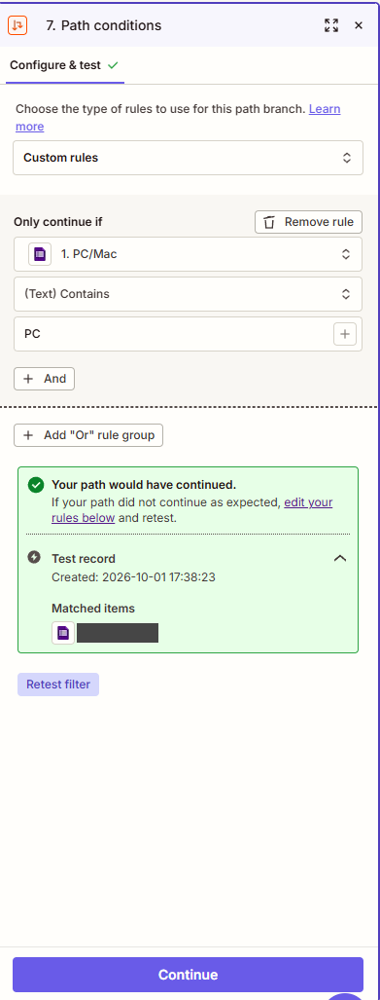

    _PC rule: matched for the PC test record (record ID redacted)._

    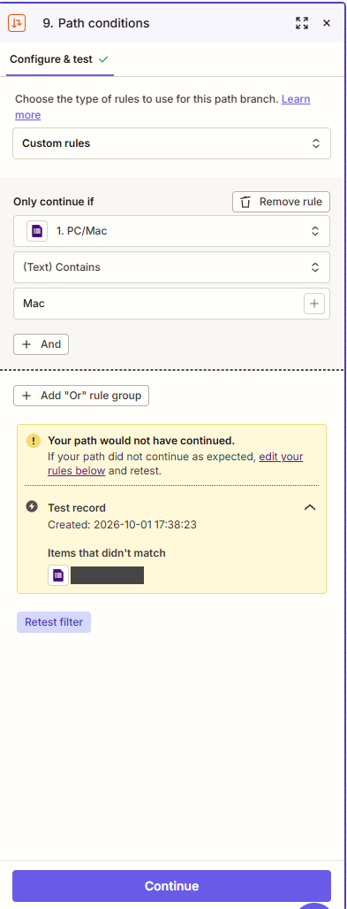

    _Mac rule: correctly did not continue for the PC test record — the branches keep a PC submission away from the Mac assignment._
8. **Assign the technician.** Each nested path updates the row created for that submission: the PC branch writes **Assigned Tech = Sarah**; the Mac branch updates the same row for Joey.

    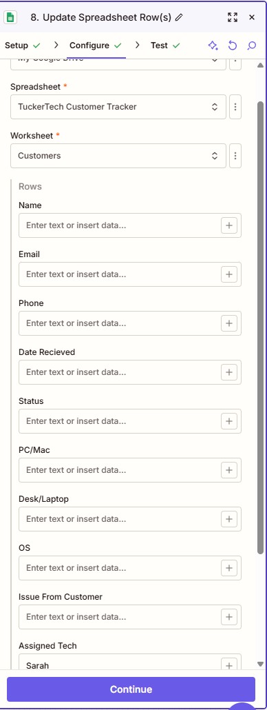

    _PC branch: Update Spreadsheet Row(s) writing the Assigned Tech value. The row identifier configuration is not visible in this capture._

    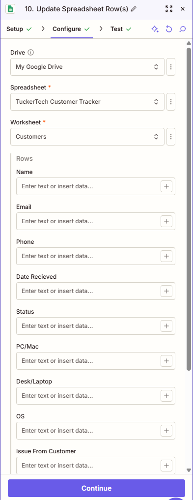

    _Mac branch: the row update step as captured. Its field values are not shown set in this screenshot._
9. **Record unsupported requests.** Path B continues when **PC/Mac contains "Other"**.

    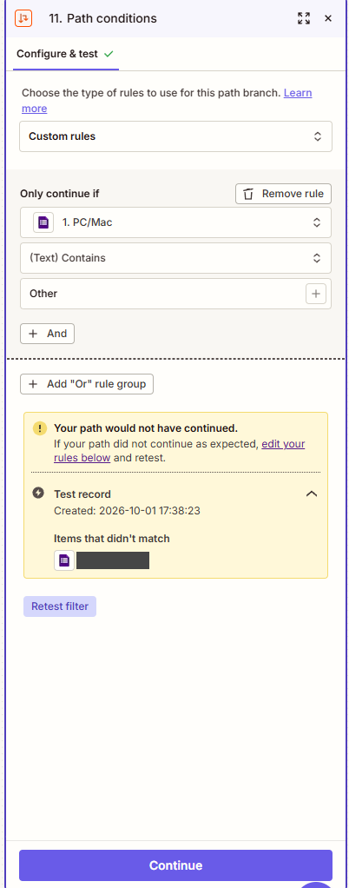

    _Path B rule: correctly did not continue for the PC test record — the PC record appears under "Items that didn't match" (record ID redacted)._
10. **Decline the request politely.** → Google Sheets **Create Multiple Spreadsheet Rows** with Status `Declined`, then **Gmail → Send Email** to **Respondent Email** with subject **"Sorry"**.

    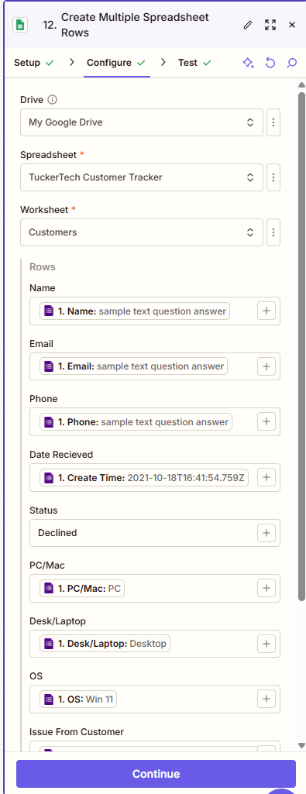

    _Create rows on the declined path: Status `Declined`; the request stays in the tracker instead of being discarded._

    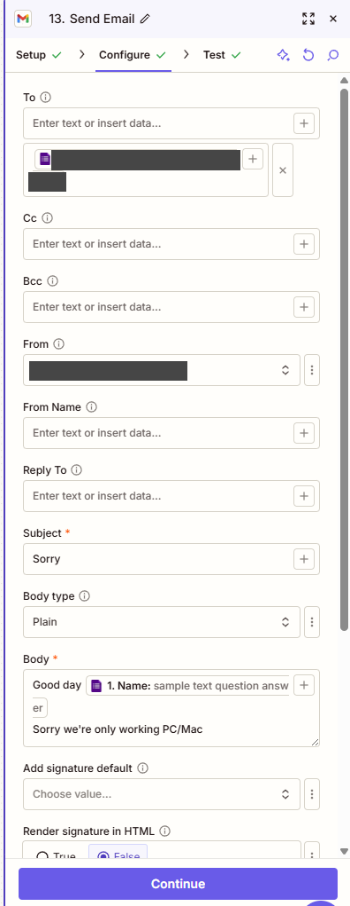

    _Gmail: subject "Sorry"; the body greets the customer by name and explains that the shop only works on PC and Mac. Addresses are redacted._

_Screenshots in this folder have the connected account address and the sample form-response record ID redacted. Captions state what each capture does and does not show._

## Testing notes and acceptance checks

| Check | Expected result | Evidence at this checkpoint |
| --- | --- | --- |
| PC submission routes to the supported branch | The "does not contain Other" rule passes | Rule test result: "would have continued", record listed under "Matched items" (step 4) |
| Mac rule does not fire for a PC request | The Mac rule rejects the PC test record | "Would not have continued" (step 9) |
| Other-device rule does not fire for a PC request | The request stays out of Path B | Record listed under "Items that didn't match" (step 11) |
| A live submission creates a tracker row | One `New Customer` row with the form answers | Recorded run: response received → formatter ran → supported path ran → row created; the run then paused at the delay |
| PC assignment completes | After the 30-minute window, Assigned Tech = `Sarah` on the same row | Not observed — captured run was paused at the delay; check the tracker after the window |
| Mac assignment completes | Assigned Tech = `Joey` on the same row | Not yet exercised — no Mac submission captured |
| Declined path works end to end | One `Declined` row and a reply email to Respondent Email; no technician assigned | Configurations captured (steps 11–13); not yet exercised with a live Other-device submission |
| Date stored in the tracker | The formatted MM/DD/YYYY submission date appears in rows from both branches | Not yet verified — captures show the raw `Create Time` in the date field, and an earlier declined-path capture showed it blank; confirm the formatter output is selected in both row-creation steps |
| Row targeting | Updates act on the row created for that submission and leave other rows untouched | The update captures show spreadsheet, worksheet, and the Assigned Tech value; the row identifier configuration is not visible in the screenshots |
| Notes stay staff-managed | Notes blank until staff fill them | Both create-row configurations leave Notes unset |

## Design decisions

- **A filter became Paths.** The first version created a row and sent an acknowledgement email; a filter then stopped unsupported requests. Paths replaced the filter so unsupported requests are **recorded as Declined and answered by email** instead of being silently dropped.
- **The delay sits after row creation.** It was initially placed before the row existed; moving it after Sheets means the request is visible in the tracker during the whole review window.
- **Nested paths replaced manual assignment.** The original plan left technician selection to staff; automatic routing (PC → Sarah, Mac → Joey) was added, while Notes remain staff-managed. Sarah and Joey are still named individuals in configuration terms — swap them for the real technicians before use.
- **The acknowledgement email was removed.** The final design sends no email on the supported path; the customer's next contact is the technician.
- **Declined requests stay visible.** The Other branch records the request rather than discarding it, so the shop can still see what came in.
- **An alternative exists.** Google Forms can record responses directly into a spreadsheet (Responses → Link to Sheets) without Zapier. Zapier was used here to demonstrate conditional routing, statuses, date formatting, a timed review window, technician assignment, and the decline email. If both are enabled, check the tracker for duplicate rows.

## Verification status

| Component | Status |
| --- | --- |
| Intake form + trigger | Configured; trigger set on the form's responses |
| Date formatter | Configured (UTC → Africa/Cairo, MM/DD/YYYY); output mapping into the tracker still to be confirmed |
| Supported / Other split | Both rules tested against the PC record with the expected results |
| Row creation (both branches) | Supported branch observed creating a row in a recorded run; declined branch configured, not yet exercised |
| 30-minute delay | Configured; the recorded run paused here (not yet observed completing) |
| Nested PC/Mac rules | PC rule matched; Mac rule correctly rejected the PC record. No Mac submission exercised yet |
| Technician updates | Configured; no completed update observed yet |
| Decline email | Configured; not yet observed delivered |
| Publication | Not confirmed |

## What this demonstrates

- Designing form-based intake: question set, field mapping, and a tracker schema that supports both accepted and declined requests.
- Conditional routing with **nested paths** — a supported/unsupported split followed by a device split, with each rule tested individually.
- Date handling: converting the form's UTC timestamp to a local date format (Africa/Cairo, MM/DD/YYYY).
- Google Sheets record creation and targeted row updates from Zapier, including status management (`New Customer` / `Declined`).
- Delayed automation as a timed review window — understanding the difference between a pause and an approval step.
- Customer email handling for out-of-scope requests, and branch-by-branch testing habits that separate "configured" from "verified".

## References

- Zapier Help Center — Paths, Delay by Zapier, and Google Sheets actions: <https://help.zapier.com>
- Google Forms and Google Sheets help: <https://support.google.com/docs>
